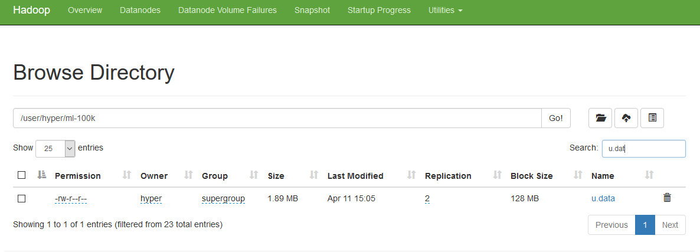
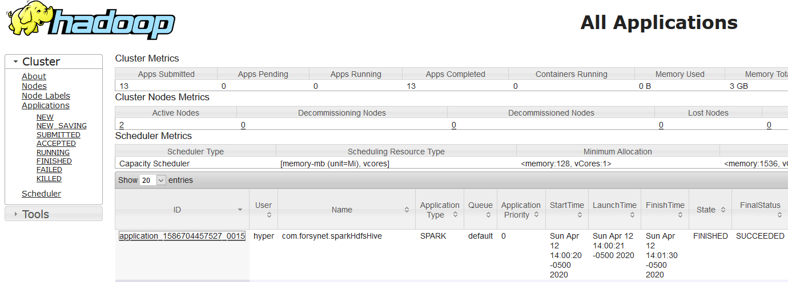
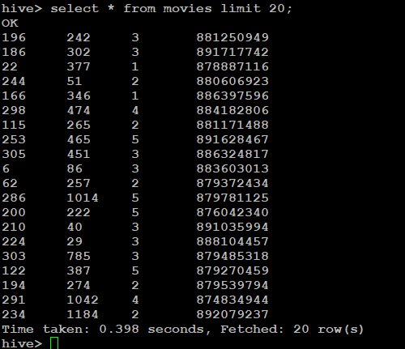
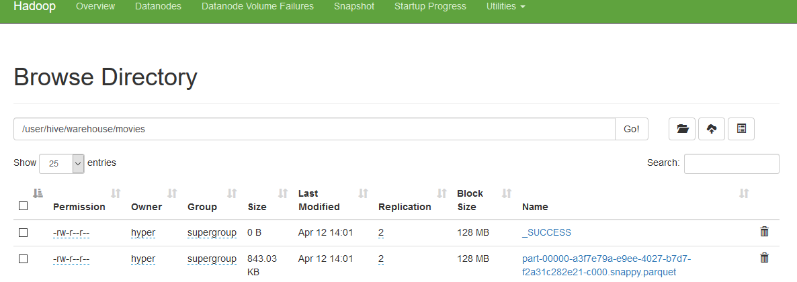
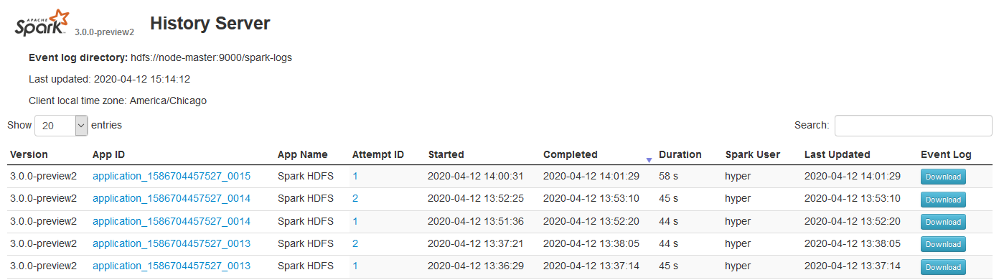

## Spark HDFS Hive

Read text file from HDFS and write to Hive table.

```shell
## Start HDFS Services 
/hadoop/sbin/start-all.sh
jps
3245 SecondaryNameNode
31517 Jps
2989 NameNode
3551 ResourceManager

## Verify  on all nodes
## node-1 node-2
jps
2643 DataNode
2867 NodeManager
24841 Jps


```

Put the text file to HDFS directory


```shell
hdfs dfs -put u.data /user/hyper/ml-100k
## Verify data
hdsf dfs -ls /user/hyper/ml-100k
```

http://192.168.1.131:9870

  


##  Create Spark Session with hive support.

```scala
  val spark = SparkSession.builder()
    .appName("Spark HDFS")
//    .config("hive.metastore.uris", "thrift://192.168.1.131:9084")
    .enableHiveSupport()
    .getOrCreate()
```

## Spark read from hdfs

```scala
  def readMovieRatingDF() = {
    spark.read
      .format("text")
      .load("hdfs://192.168.1.131:9000/user/hyper/ml-100k/u.data")
      //      .load("src/resources/data/u.data")
      .select(
        split(col("value"),"\t")(0).cast("long").as("userId"),
        split(col("value"),"\t")(1).cast("long").as("movieId"),
        split(col("value"),"\t")(2).cast("integer").as("rating"),
        split(col("value"),"\t")(3).cast("string").as("date")
      )
```

### Write to Hive

```scala

  def writeToHive(): Unit ={
    readMovieRatingDF()
      .write
      .mode(SaveMode.Overwrite)
      .saveAsTable("default.movies")

  }

```

Make sure the hive-site.xml is copied to spark/conf directory

Create Artifacts from Intellij .

## Spark-submit using yarn master

```shell
spark-submit \
 --class com.forsynet.sparkHdfsHive \
 --master yarn \
 --deploy-mode cluster \
sparkhdfshive_2.12-0.1.jar
```




## Verify table creation in hive .

```shell
hive/bin/hive
hive> select * from movies limit 20;

hive> describe movies;
OK
userid                  bigint
movieid                 bigint
rating                  int
date                    string
Time taken: 0.136 seconds, Fetched: 4 row(s)

```




```shell

```

## Verify hive warehouse for file creation. 

```
hdfs://node-master:9000/user/hive/warehouse

hyper@node-master:~/spark/$ hdfs dfs -ls /user/hive/warehouse/movies
Found 2 items
-rw-r--r--   2 hyper supergroup          0 2020-04-12 14:01 /user/hive/warehouse/movies/_SUCCESS

-rw-r--r--   2 hyper supergroup     863266 2020-04-12 14:01 /user/hive/warehouse/movies/part-00000-a3f7e79a-e9ee-4027-b7d7-f2a31c282e21-c000.snappy.parquet

```




## Spark History Server

```sh
## Start Spark history server
spark/sbin/start-history-server.sh

Specify the sparkconf required for history server in spark-defaults.conf file

spark.history.provider            org.apache.spark.deploy.history.FsHistoryProvider
spark.history.fs.logDirectory     hdfs://node-master:9000/spark-logs
spark.history.fs.update.interval  10s
spark.history.ui.port             18080
```



## Hive Start Commands

```
## Start Hive  services 

hive/bin   hive

hive --service hiveserver2 --hiveconf hive.server2.thrift.port=10001 --hiveconf hive.root.logger=INFO,console --hiveconf hive.server2.thrift.bind.host=192.168.1.131

hive --service metastore   
```

